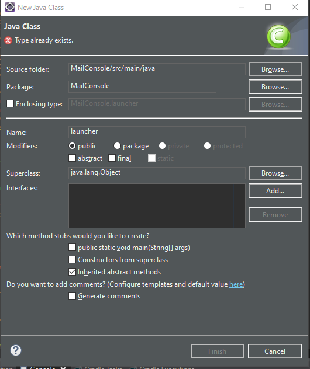

# E-Mail in Java

Sending emails in using java is surprisingly easy now that we have our trusty Package manager. It is still very important to know what is happening behind the scenes of the code that we are running so that we can properly debug it. That brings us to the subject of emails, and how they work.

### Email Servers

Email servers have 2 main jobs. **1.** The transfer Of mail. **2.** The storage and access of mail received. 

The transferring side of the server happens over Simple Mail Transfer Protocol (SMTP) if you want to send mail from your mail server to another you connect to your servers SMTP port and tell it to send mail to another address. The mail server then takes the address that you give it and it uses a Domain Name System (DNS) service to translate that email address into an IP address. It then attempts to connect to the mail server at that IP address and sent the E-mail to it. the Email server that is receiving the message will then store the E-Mail so that when the recipient logs into their email they can view the message.

Storage and Review of the Message Is slightly more complicated because there are 2 methods. POP and IMAP.

POP stand for Post Office Protocol, and it works very similar to the post office. It keeps the mail until you come and pick the mail up. The mail is no longer on the server it is now local on whatever email client you chose to use. such as Mozilla thunderbird. POP's main benefit is that the mail server does not have to store thousands of E-Mails. But the email is only available at the computer that connected. and downloaded the message. By analogy, If you go pick up a package from the post office and leave it at home. You cant go back to the post office to get it. You have to go back home. 

IMAP is the more commonly used Protocol. it stands for Internet Message Access Protocol. Its name is also very fitting. You can access the mail from anywhere because it is left on the server. Any place you have internet you can access the messages that are on the server. For almost all purposes IMAP is the superior method. I don't know of any use cases for POP other then maybe high level security emails that can only be at one location and should not be left on the Internet for long. 

Now that those differences are out of the way we can talk about access. If you want to access mail stored on a Server you must connect to the correct address and port for the protocol you wish to use. Most mail servers support both IMAP and POP. Further on we will show how to configure the connection to be fore IMAP, as well as ports and servers. 

The main take away is this. Sending Email is a different connection then Viewing Email. They have different Ports, Different Protocols, Different Server Names. Often times providers will publish there server addresses and ports as shown https://support.google.com/mail/answer/7126229?hl=en

[]("img/GmailServerSettings.png")

### Gradle Setup

For this tutorial we will want to create a new Gradle Project. In our **build.gradle** we want to add the following in the dependencies section

```java
implementation group: 'com.sun.mail', name: 'gimap', version: '1.6.5'
```

This will add the Java Mail code to our project. This allows us to skip past the incredibly difficult task of building a mail client.

make sure after you add the line to save the project and right-click **build.gradle** in the Package Explorer and got to **Gradle > Refresh Gradle Project** 

### CODE 

Gmail has great security. As such school emails may not work with this sample code. and personal Gmail accounts my require you to use an app password. Here are the instructions for generating [App Passwords](#app-passwords).  

From here I create a class called Launcher 



In this program I also use `Java.util.prefs.Preferences` Think of Preferences like a persistent `HashMap<String, Object>` It allows you to keep settings even if you terminate the program. It isn't typically used for program data storage, but for a small program like this it works perfect. 

```java
// Add this after 
//public class launcher {
public Preferences prefs  = Preferences.userRoot().node(launcher.class.getName());


// NOTES --------------

// This allows me to use
prefs.put(key,value) // Key and Value are both Strings
// As well as 
prefs.putInt(key,intValue) // key is string and Value is int
 
// Next time I launch the program i can use
prefs.get("imap","imap.gmail.com")
// This will give me the value of key IMAP or a default value of "imap.gmail.com" if the key "imap" was never set.
 
prefs.getInt("imapPort",993) // will do the same with an int value 
    
// Other data types are also possible eclipse should be able to give them all to you 
```


To start off we are going to make a quick code snipped that will send an email.

```java
Properties props = System.getProperties();
props.setProperty("mail.smtp.host", "smtp.gmail.com"); // Replace smtp.gmail.com with whatever your smtp server 
                                                               // If you are using a provider other then gmail
props.setProperty("mail.smtp.port", "465"); 
props.setProperty("mail.smtp.auth", "true");
props.setProperty("maul.smtp.socketFactory.port","465");
props.setProperty("mail.smtp.socketFactory.class", "javax.net.ssl.SSLSocketFactory");

Session session = Session.getDefaultInstance(props, 
	new javax.mail.Authenticator {
        public PasswordAuthentication getPasswordAuthentication() 
		{   // put your username and password here
			return new PasswordAuthentication("< username >", "< password >");
		}
    });

try 
{
	System.out.println("Sending Message");
	MimeMessage msg = new MimeMessage(session);
	msg.setFrom("< your email address>"); // If you put an email address that does not match your email address, 2 things can 
                                          // happen. 1. if you are using GMail. The mail server will reject sending the email.
                                          // 2. If you are using a more lax email server, This is know as email spoofing. You 
                                          // can send the email as whoever you want to be. however this is frowned upon.
	msg.setSubject("Hello World");
	msg.setText("This is a test email to see if the connection and code works");
	msg.addRecipient(Message.RecipientType.TO, new InternetAddress("caleb.baker194@gmail.com"));
			
	Transport.send(msg);
	System.out.println("Message Sent Successfully");
}catch (MessagingException e) {System.out.println("Message Failed To send"); e.printStackTrace();}

// At this point. If you saw Message Sent Successfully. Then you know that your username and password work
// If you have an error. you probably need to get an app password. Also make sure that for username you used your complete
// email address including @chisddevils.com or @gmail.com etc.

// If you have a specific errors like
// Incorrect Password
// javax.mail.AuthenticationFailedException: [AUTHENTICATIONFAILED] Invalid credentials (Failure)
// Need App Password
// javax.mail.AuthenticationFailedException: [ALERT] Application-specific password required: 
// https://support.google.com/accounts/answer/185833 

// Most errors you can google the first line and add "JAVA Mail" to the search and you can find a good answer
```

### Mail Console

I made a brief program that shows how to get a messages in your inbox and send an email. but programming is only ever limited by imagination. You can do so much more with Java Mail. You have access to every email in the account as well as sending email. You also have access to the email head which includes some more information then you can see on any mail client. Much of it is useless to us, but Some of it is interesting. Just some ideas of what you can do.

- Check the email server's Country Of Origin (which you can do from java using a web service and an IP address).
- Check the email's from validity 
  - Using DNS you can see if the email originates from where it says its from. The email header contains the IP trail directly to the mail server.
- Check attachments for Viruses
- Convert Emails to Texts and Texts to emails
  - This is helpful if your company has an email based workflow but wants to expand to include mobile customers that only text. (Which is a massive market)
- Automated Document Mailing And request.
  - Send Customers invoices
  - Set up a mail based document server (special subjects get auto reply's with documents attached)
- Spam Filtering 
- Automatic Trash Deleting (Gmail added that recently)
- Local Mail archiving (Save mail on a computer if it is older then a certain date in order to save mail server storage)

### Starting Points

If you are sending mail or checking mail you will almost always start with

```java
Session session = Session.getDefaultInstance(props, new MyMailAuthenticator());
```

A Session contains all of the information related to the mail server and protocol your are connecting with. 

If you are viewing mail. then you will use the session to access the Store

```java
Store store = session.getStore("imaps"); // The 's' on the end of imap stands for Secure
```

The Store is basically the mail servers data store. but you still have to connect

```java
store.connect(prefs.get("imap", "imap.gmail.com"),prefs.get("username", ""),prefs.get("password",""));
```

now that you have done this you have made a connection to the mail server. if you want to know all that you can do with the Store

you can simply type `store.` after the above lines and Eclipse will show you all the methods that are available. id like to point out some

```java
getFolder(String name) // This is how you get a specific folder.
addFolderListener(FolderListener I) // Check to see when folders are created, deleted, or renamed
```

And when you have a folder 

```java
IMAPFolder folder = (IMAPFolder) store.getFolder("Inbox");
```

You can check what folder has `folder.` 

```Java
folder.addMessageCountListener( MessageCountListener l);
// With this you can ron code every time a message is added or removed. 
// You can create a MessageCountListener like this

private class MyMessageListner implements MessageCountListener
{
    @Override
    public void messagesAdded(MessageCountEvent e) {
        // Code you want to run on message received
        // e.getMessages(); returns Message[] and gives you all the messages that were added. (new messages)
    }

    @Override
    public void messagesRemoved(MessageCountEvent e) {
        // Code to run when a message is remove
    }
}

// Add it to the folder like this 
folder.addMessageCountListener( new MyMessageListner());
```

### Conclusion

In everything. Eclipse will be your friend. It will give you information on what every variable and Object can do. So that you can see the possibilities for yourself.

### App Passwords

https://support.google.com/accounts/answer/185833

Log into G-Mail First. In the Top Right Corner Select Your Name And Select **Manage Account**


Next On the left hand side Select **Security**


On the Security Page Select **App Passwords**


After that You will be on the screen where you can create app passwords. 

I suggest an App of Mail and A device custom. Name it something that you will recognize. 

When you click generate. **This is the only time you will see this password**. Once you leave that screen the app password is gone. If you loose it you can delete that password and create a new one. Just because it is an app password doesn't mean that you should give it to anyone. It is a password with limited permissions. Including Sending and Receiving mail.

