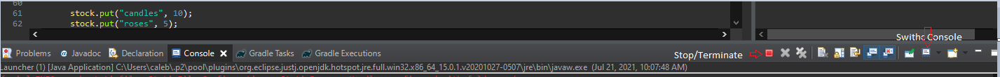
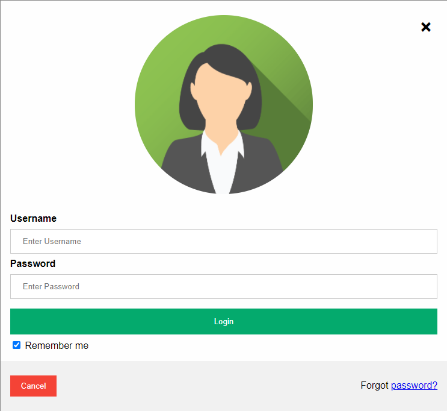
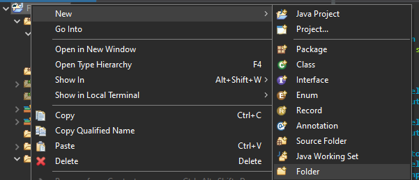
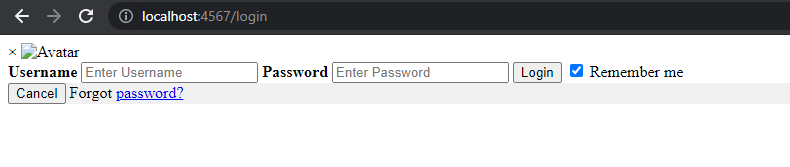
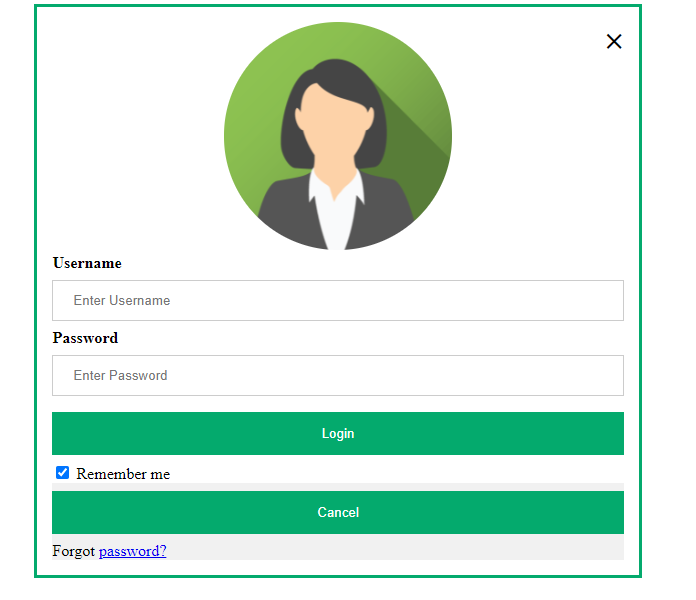

# Web Servers

### Prelog

Just a quick bit of eclipse to help you through this one. Web servers are not like a typical program. They do not terminate automatically. 



When you update java code. You must terminate and relaunch. If you accidentally launch before you terminate you will get on error 

```java
java.io.IOException: Failed to bind to /0.0.0.0:80
```

When you get this error use the Switch console button and terminate all active console's. This will make sure that you have no other instance of your program running. 

If you make a change to an HTML file or a CSS file. you do not need to terminate and relaunch. you can simply refresh the web page.

### Introduction

This is possible one of my personal favorite subjects. Web Servers. How do I connect to people around me and offer services to people around the world.  For this Simple Web App we are going to use (sparkjava)[https://sparkjava.com/]. Why? It is incredibly simple. Possible the most simple web server implementation to use that is out there. However. If you are really into performance, you can find out how to set up servers on something like NGINX. To start off create a Gradle project and add this to the **build.gradle** under the dependencies section.

```java
// https://mvnrepository.com/artifact/com.sparkjava/spark-core
// SparkJava code.  
implementation group: 'com.sparkjava', name: 'spark-core', version: '2.9.3'
   
// https://mvnrepository.com/artifact/org.slf4j/slf4j-simple
// A logging package that is needed to run SparkJava.
implementation group: 'org.slf4j', name: 'slf4j-simple', version: '1.7.30'
```

No we are going to map a one location. "/hello"

```java
import spark.Request;
import spark.Response;
import spark.Spark;

public class Launcher {
	
	public Launcher()
	{
		Spark.get("/hello", (req,res) -> helloResponse(req,res) );
	}
	
	public String helloResponse(Request req,Response res)
	{
		return "Hello World";
	}
	
	public static void main(String args[])
	{
		new Launcher();
	}
}
```

That is it. Now run the application and you should see The log Results Something like this

```java
[Thread-0] INFO org.eclipse.jetty.util.log - Logging initialized @411ms to org.eclipse.jetty.util.log.Slf4jLog
[Thread-0] INFO spark.embeddedserver.jetty.EmbeddedJettyServer - == Spark has ignited ...
[Thread-0] INFO spark.embeddedserver.jetty.EmbeddedJettyServer - >> Listening on 0.0.0.0:4567
[Thread-0] INFO org.eclipse.jetty.server.Server - jetty-9.4.31.v20200723; built: 2020-07-23T17:57:36.812Z; git: 450ba27947e13e66baa8cd1ce7e85a4461cacc1d; jvm 15.0.1+9-18
[Thread-0] INFO org.eclipse.jetty.server.session - DefaultSessionIdManager workerName=node0
[Thread-0] INFO org.eclipse.jetty.server.session - No SessionScavenger set, using defaults
[Thread-0] INFO org.eclipse.jetty.server.session - node0 Scavenging every 660000ms
[Thread-0] INFO org.eclipse.jetty.server.AbstractConnector - Started ServerConnector@56f84b29{HTTP/1.1, (http/1.1)}{0.0.0.0:4567}
[Thread-0] INFO org.eclipse.jetty.server.Server - Started @705ms
```

The last line tells you that the server is up 

`[Thread-0] INFO org.eclipse.jetty.server.Server - Started @705ms`

Now open up google chrome (or any inferior web browser) and in the address bar put

http://localhost:4567/hello

You should come up with a web page that says Hello World!

### Lambda Expressions

At this point you may be wonder what the following Syntax is

```java
(req,res) -> helloResponse(req,res)
```

This is know as a Lambda Expression. And it is most easily defined as **(Parameters) -> (Implementation)**. Lambda Expression is one of the biggest things that Java 8 offered (this is not possible in Java 7. Java 8 was release in March 18, 2014). 

We could also rewrite or code like this if this makes more sense to you

```java
Spark.get("/hello", (req,res) -> {return "Hello World";} ); // This simply allows you to skip the function definition
// Or even
Spark.get("/hello", (req,res) -> "Hello World" ); // Though this is quite limited
```

There are multiple tutorials on Lambda Expressions, But you don't have to know them very well for this tutorial as I will basically show you how to use them. 

### Website Structure and Technology. 

Okay now we need to slow down and do a recap. we need to answer multiple questions. 

**1.** Why **Spark.get(...)**. GET Is a special verb that matches an (HTTP request type)[https://developer.mozilla.org/en-US/docs/Web/HTTP/Methods] And there are multiple request types. Spark Supports 

- GET - The `GET` method requests a representation of the specified resource. Requests using `GET` should only retrieve data.
- POST - The `POST` method is used to submit an entity to the specified resource, often causing a change in state or side effects on the server.
- PUT - The `PUT` method replaces all current representations of the target resource with the request payload.
- DELETE - The `DELETE` method deletes the specified resource.
- CONNECT
- OPTIONS
- TRACE
- HEAD

For most purposes we are going to use the first 4. The Mozilla documentation can help you understand them better if you desire. But a note that I want to make. We are making the Server. We decide what each request does and how it is processed. With that being said there are things built into the request to take into mind. GET requests have a character limit of 2048 characters. If you want to send a lot of data to a server in one request even if you want to get data back from the server you will need to use POST. post puts the data into the header where as GET puts it into the URL.

So why http://localhost:4567/hello 

It is important to under stand every part of a URL.

- http - This is the Protocol. Hyper Text Transfer Protocol. https would be the same thing with Secure on the end. HTTPS is encrypted where as http isnt

Spark Java will also recommend statically importing Spark.  which would make your code like 

```java
//import spark.Request;
//import spark.Response;
//import spark.Spark;
import static spark.Spark.*;

// And your mapping would change 
//Spark.get("/hello", (req,res) -> helloResponse(req,res) );
get("/hello", (req,res) -> helloResponse(req,res) );
```

This does the same thing. but for visibility I will not be using the static import. 

## HTML

In the Example Above we Returned a Simple String. What if we wanted to return an HTML file. A web Page in the format that we know. So I went to the internet and found A (login form)[https://www.w3schools.com/howto/tryit.asp?filename=tryhow_css_login_form_modal] That I liked the look of. And copied and pasted the HTML. 



So to take it step by step. Right click on the Project Inside the **Package Explorer** And create A new Folder called  **resources** located inside of **src/main** (Note that the folder resources may already exists.) You can also do this in windows file explorer.



Right Click on **resources** and create a new folder called **html** After that Right click on **html** and create a file called **login.html**.

In the end you should have a file Treelike this 

```java
workspace > FunWebsite > src > main > resources > login.html
```

 Now open that file and put this html into it and save. (you can remove all the commends anything inside <!-- --->)

```html
<div> <!-- div is a content division element. It allows your to seperate everything inside as its own content.-->
   <!-- An image with its source at src-->
  <div> <!--  A sub content division to seperate the input from the image. you will see why later-->
    <label for="uname">Username</label>
    <input type="text" placeholder="Enter Username" name="uname" required>

    <label for="psw">Password</label>
    <input type="password" placeholder="Enter Password" name="psw" required>
        
    <button type="submit">Login</button>
    <label>
  </div>
  <div style="background-color:#f1f1f1"> <!-- Seperate Content Division for other options not related to login -->
    <button type="button" >Cancel</button>
    <span >Forgot <a href="#">password?</a></span>  <!-- span is a simple seperator and does nothing on its own-->     
  </div>
</div>
```

So we have our html blue-print. now we are going to go back to **Launcher.java**.

For this next part we are going to use a template engine. These can be very helpful in rendering dynamic web pages. It is not built into the spark java package. so in our **build.gradle** file under the **dependencies** section add

```java
// https://mvnrepository.com/artifact/org.apache.velocity/velocity
implementation group: 'com.sparkjava', name: 'spark-template-velocity', version: '2.7.1'
    
// You may also need to add velocity. 
// spark-template-velocity is a wrapper to make things easier 
    
// https://mvnrepository.com/artifact/org.apache.velocity/velocity
implementation group: 'org.apache.velocity', name: 'velocity', version: '1.7'
```

Right click **build.gradle** in the package explorer and select **gradle > refresh gradle project**.

Now lets map another route

```java
	public Launcher()
	{
		Spark.get("/hello", (req,res) -> helloResponse(req,res) );
		Spark.get("/login", (req,res) -> loginResponse(req,res) ); // Line to Add
	}
```

and the function loginResponse will look like this

```java
public String loginResponse(Request req, Response res) {
    Map<String, Object> model = new HashMap<>(); // This will store data in case you want things in the html document to
                                                 // render dynamically
    // VelocityTemplateEngine is what we use to render the html document
	return new VelocityTemplateEngine().render(
	    new ModelAndView(model, "html/login.html")
	);
}
```

note that Spark Java makes its resource path **src/main/resources** so we can use a relative path for anything inside. and in most cases you must use a relative path. 

Now in your web browser go to http://localhost:4567/login to see our beautif...



## CSS and Static Files

Oh. Well that doesn't look so good. The image is missing and everything is all wrong. This is because web pages are set up in 2 or 3 parts depending on how you look at it The html, which is the divs and the inputs and the buttons. the CSS, this is the style side of the web page. this separates the acceptable websites from great websites. and the scripts which we will get to later. 

The first thing we are going to do is fix the image. so open up https://www.w3schools.com/howto/img_avatar2.png. save this image to **src/main/resources/images/avatar.png** This will put the image on our computer so that our web server can deliver it. But it has not been mapped yet on the web server. we are going to map the static files. using 

```java
	public Launcher()
	{
		Spark.staticFiles.location("/"); // Static files // Add this line
		Spark.get("/hello", (req,res) -> helloResponse(req,res) );
		Spark.get("/login", (req,res) -> loginResponse(req,res));
	}
```

Now we should be able launch our web server and load the image by opening http://localhost:4567/images/avatar.png. 

Now lets look at adding CSS to our web page. we are going to modify **login.html** to be more like a full web page then an html block. all web pages have a head and a body

```html
<!DOCTYPE html>
<html>
<head>
<meta charset="ISO-8859-1">
<!-- This is the most important line and it must be in the header marked by the head tag-->
<link rel="stylesheet" href="css/login.css"> <!-- This is where the CSS gets imported -->
<title>Login</title>
</head>
<body>
	<div class = "login-holder"> 
	  <form>
	    <span class = "close" title="Close Modal">&times;</span>
	    <div>
	      
	    </div>
	
	    <div>
	      <label for="uname"><b>Username</b></label>
	      <input type="text" placeholder="Enter Username" name="uname" required>
	
	      <label for="psw"><b>Password</b></label>
	      <input type="password" placeholder="Enter Password" name="psw" required>
	        
	      <button type="submit">Login</button>
	      <label>
	        <input type="checkbox" checked="checked" name="remember"> Remember me
	      </label>
	    </div>
	
	    <div style="background-color:#f1f1f1">
	      <button type="button" onclick="document.getElementById('id01').style.display='none'" >Cancel</button>
	      <span >Forgot <a href="#">password?</a></span>
	    </div>
	  </form>
	</div>
</body>
</html>
```

With are html revised we now need to make our **login.css** available at the location of css/login.css so create a file inside **src/main/resources/css/login.css** and open it inside of eclipse.  https://www.w3schools.com/css/default.asp is an invaluable resource when you are learning html, css, or java script. you will want to keep w3schools open most of the time. I would advise reading through https://www.w3schools.com/css/css_selectors.asp early on to see how you select what the css targets. but for now I will give you a simple css to start off

```css
/* The Close Button (x) */
.close {
  position: relative;
  float: right;
  
  color: #000;
  font-size: 35px;
  font-weight: bold;
}

.close:hover,
.close:focus {
  color: red;
  cursor: pointer;
}

/* Full-width input fields */
input[type=text], input[type=password] {
  width: 100%;
  padding: 12px 20px;
  margin: 8px 0;
  display: inline-block;
  border: 1px solid #ccc;
  box-sizing: border-box;
}

/* Set a style for all buttons */
button {
  background-color: #04AA6D;
  color: white;
  padding: 14px 20px;
  margin: 8px 0;
  border: none;
  cursor: pointer;
  width: 100%;
}

button:hover {
  opacity: 0.8;
}

/* Extra styles for the cancel button */
.cancelbtn {
  width: auto;
  padding: 10px 18px;
  background-color: #f44336;
}

/* Center the image and position the close button */
.imgcontainer {
  text-align: center;
  margin: 24px 0 12px 0;
  position: relative;
}

img.avatar {
  position: relative;
  width: 40%;
  margin-left: 30%;
  border-radius: 50%;
}

.container {
  padding: 16px;
}

span.psw {
  float: right;
  padding-top: 16px;
}

.login-holder {
	width : 30%;
	margin : auto; 
	border: 3px solid #04AA6D;
	padding: 15px;
}
```

This will give us a nice pretty login page. http://localhost:4567/login



## Forms 

You may have noticed that we used a tag in the web page <form> A more in depth explanation can be found here https://www.w3schools.com/html/html_forms.asp. 

For now we are going to handle the login at our server by changing our html from

```html
	<div class = "login-holder"> 
	  <form>
	    <span class = "close" title="Close Modal">&times;</span>
```

To 

```html
	<div class = "login-holder"> 
	  <form action="/login" method="post">
	    <span class = "close" title="Close Modal">&times;</span>
```

Notice it has the same path as the page we loaded. This is not necessary. we can map this wherever we want. I like to keep the paths similar. also notice the method post. we can map it to get because if the method is get it simply returns the login scree. so post is where we are going to send the login data. 

back to **Launcher.java**

```java
	public Launcher()
	{
		Spark.staticFiles.location("/"); // Static files
		Spark.get("/hello", (req,res) -> helloResponse(req,res) );
		Spark.get("/login", (req,res) -> loginResponse(req,res));
		Spark.post("/login", (req,res) -> loginPostResponse(req,res)); // Add this Line To map the post 
	}

	// Add this function
  	public String loginPostResponse(Request req, Response res) {
		String username = req.queryParams("uname"); // uname is the name of the input on the html file
		String password = req.queryParams("psw"); // queryParams is a way to access data passed from the web page
		if(username.equals("confines") && password.equals("noescape")) // Check to see if the values are correct 
			return "Success"; // If they are you can return another web page but to be brief we will return success
		
		return loginResponse(req,res); // If it fails we will return the same login page. and allow them to try again
	}
```

You can now save and launch the program. navigate to the login page http://localhost:4567/login

## Server Configuring

time to address the ugly **:4567** in all the url's

http runs on port 80 by default and https runs on port 443 by default

the server is configured by default to run on port 4567 so we have to tell the what port to use in the url. we can fix this by adding `Spark.port(80);` before any routes are mapped. 

we can also change it to https. but this requires a bit more work. you have to get your own SSL certificate and create files that you can link to. the only way that I have found to do it for free is to use linux and a software called certbot. You also need to be able to route traffic to your specific computer. I can cover that later but it is more in depth and would require its own section entirely. 

## Java-Script

Lets take a look at how to execute code on the web page. Despite its similar name. Java-Script is not Java. Java-Script is a Script Oriented Language and Java is an Object Oriented Language. They have different fundamentals and deferent places in the world. 

However you can run Java-Script right on your web page. In fact, Many of the online calculators are built in Java Script. 

Lets Go ahead and map a route to a page that we want to play with Java-Script on 

```java
// This goes inside public Launcher(){}
Spark.get("/java-script-fun", (req,res) -> jsTutorial(req,res));

// Now create the function 
public String jsTutorial(Request req, Response res) {
    Map<String, Object> model = new HashMap<>();
    return new VelocityTemplateEngine().render(
        new ModelAndView(model, "html/js-tutorial.html")
    );
}
```

Now I want to make a Circular object calculator. Where I Input the radius and it give me the Diameter, The Area, The surface Area of the Sphere and the Volume of the sphere. 

So I am going to make an html document that simply has some fields and labels

```html
<!DOCTYPE html>
<html>
	<head>
		<meta charset="ISO-8859-1">
		<title>JS is Fun</title>
	</head>
	<body>
		<label for="radius">Radius: </label>
		<input type="text" name="radius">
		</br>
		<label for="diameter">Diameter: </label>
		<input type="text" name="diameter">
		</br>
		<label for="area">Area: </label>
		<input type="text" name="area">
		</br>
		<label for="surface">Surface: </label>
		<input type="text" name="surface">
		</br>
		<label for="volume">Volume: </label>
		<input type="text" name="volume">
		</br>
		<button onclick="calculate()">Calculate</button>

	</body>
</html>
```

That will give us a very basic web page with some fields to modify in the script. 

Now in the blank space before the closing body tag put this

```javascript
		<script>
		function calculate()
		{
			var radius = document.getElementsByName("radius")[0].value;
			
			var diam = radius*2;
			var area = 2 * Math.PI * radius;
			var surf = 4 * Math.PI * Math.pow(radius,2)
			var volume  = 4.0 / 3.0 * PI * Math.pow(radius,3)
			
			document.getElementsByName("diameter")[0].value = diam
			document.getElementsByName("area")[0].value = area
			document.getElementsByName("surface")[0].value = surf
			document.getElementsByName("volume")[0].value = volume
		}
		</script>
```

Now you should be able to open up http://localhost/java-script-fun after you relaunch your server.  enter a radius and hit calculate. 

Note that when you use JS in a web page. you can debug the code live on google chrome by pressing F12. Say for instance instead of Math.PI I simply put PI on one of the lines 


It will give you the error as well as the line. Anything you can do in JS you can also do in the console. So if you entered 

```javascript
document.getElementsByName("diameter")[0].disabled = true
```

You would notice that you can not enter text in the diameter box. 

### Other Triggers

What if we wanted to take this calculator a step farther? Taking a quick look at the documentation https://www.w3schools.com/tags/ev_onchange.asp If we remove the `<button></button>` and change the radius input to 

```javascript
<input onchange="calculate()" type="text" name="radius">
```

Now any time we change the text in the radius column we recalculate all the other fields automatically.

### Script import

Also if we want to separate our script and html file we can create a file located at **src/main/resources/js/js-tutorial.js** move everything in between <script> Code here </script> to the new file. 

Then in the <head> Section of the html file we add 

```html
<script src="js/js-tutorial.js"></script>
```

Now when the html document loads it will import the java-script file from the url. 

for small files it is some times easier to keep them together. 

### More About JS

Also this is the very bare minimum of what JS can do. I cant begin to teach you everything. In my college senior project, we made a webcam chat where you could draw on the screen. the video chat and the drawing were all made possible in pure java script. you can create chat rooms with it you can do complex chart drawing you can send data to servers and download data from servers. one thing you will see quite often is AJAX and JQuery. Both of those are code packages for java script. that allow you to do things like download data over the internet in the background while the web page can remain responsive and loaded. I might visit some more complex things later on but for now we will leave it at this. 

## Dynamic Rendering

Earlier we glossed over the **VelocityTemplateEngine**. We used it to render a simple html page. But what about html pages that differ based on the user or based on input. Velocity is one of the many tools that someone can used to dynamically load a web page. You can also use Java-Script for this purpose if you want. In the world of web development. There is often at least 3 ways to do what you are trying to do. 

As for velocity. Most of the magic happens with the model. 

```java
Map<String, Object> model = new HashMap<>();
```

we have used it in our code up to now but left it empty. Now we are going to use it. 

Lets start by mapping another path. 

```java
Spark.get("/velocity", (req,res) -> velocityRender(req,res));
// ...
public String velocityRender(Request req, Response res) {
    Map<String, Object> model = new HashMap<>();

    model.put("Name", "Confines");
    model.put("Students", 15);

    HashMap<String,Integer> stock = new HashMap<String,Integer>();

    stock.put("candles", 10);
    stock.put("roses", 5);
    stock.put("plates", 8);

    model.put("stock", stock);

    return new VelocityTemplateEngine().render(
        new ModelAndView(model, "html/velocity.html")
    );
}
```

Now that we have our map we can create our html file. located at **src/main/resources/html/velocity.html** 

```velocity
<!DOCTYPE html>
<html>
<head>
<meta charset="ISO-8859-1">
<style>
table, th, td {
  border: 1px solid black;
  border-collapse: collapse;
}
</style>
<title>Dynamic Render</title>
</head>
<body>
  Classroom: $Name
  </br>
  Students: $Students
  <table>
  <tr>
  <th>Item</th>
  <th>Stock</th>
  </tr>
  #foreach( $key in $stock.keySet())
      <tr>
        <td>
          $key
        </td>
        <td>
          $stock.get($key)
     	</td>
      </tr>
  #end
  </table>
</body>
</html>
```

Velocity Could Be considered its own language. In fact. the even call it Velocity Template Language (VTL). Its well documented and you can get tons of help by simply googling how to use it. For our case

the $Text is typically a variable name. 

#foreach is a loop mechanism within VTL. 

so model holds all the data for the Velocity engine to use. you can do multiple things inside the html document and this is a simple example. 

## Logging In and Verification.

This will be the last section in this tutorial but probably one of the most important. Up until now everything has ben stateless. meaning it doesn't matter who is using the web page it will work the same. but for the most part this will never happen. You will need to log in and verify users in a safe and secure manner. 

First thing to note if you plan on setting up a large server. **NEVER STORE THE PASSWORDS.** This may seem simple but it is ignored often today. If you have ever had the question, Why do I have to reset my password why cant they just send it to my email? the answer is many companies do not know your password. nor do they have any feasible way of getting your password. this is one of the most important things in web security. If your database gets compromised. you do not want to give all your customers login and passwords our to hackers. most people use the same password in all places. so here is how you fix that problem 

### BCript

This is one of a couple of options, such as PBKDF2, and SCrypt.  this is not built into java so we are  going to add the following to our **build.gradle**

```java
// https://mvnrepository.com/artifact/org.mindrot/jbcrypt
implementation group: 'org.mindrot', name: 'jbcrypt', version: '0.4'
```

Don't forget to refresh the Gradle project

This gives you a couple of easy ways to use BCript inside java without writing the implementation your-self

BCript does 2 things for you. It allows you to do password verification without storing users passwords. It also takes time to process the algorithm. If it increase the processing time  from 1 millisecond to 30 milliseconds, legitimate users will never notice the change. A brute force attack will now take 300 years instead of 10. 

```java
// This will generate your hash so that the password "confines" will come out looking something like
// $2a$12$45YZpvHZg6p0M7H1XRyQXOaTSWy//5wl5E1hegcpCChtANXaH13Ae

String hashedpass = BCrypt.hashpw(password, BCrypt.gensalt(12)); // Default is 10

// It takes an incredible amount of time to try and reverse this. And you could get the wrong result even if you do reverse it. 
// Multiple different words have the same hash result. 

// We would typically store hashedpass on the databas as the users password

// We can if the user input = the correct password with 
Boolean passCheck = BCrypt.checkpw(candidate, hashedpass) 
```

So lets go ahead and modify the login page function.

```java
public String loginPostResponse(Request req, Response res) {
    String username = req.queryParams("uname");
    String correctPW = BCrypt.hashpw("noescape", BCrypt.gensalt(12));
    String password = req.queryParams("psw");
    if(username.equals("confines") && BCrypt.checkpw(password, correctPW) )
        return "Success";

    return loginResponse(req,res);
}
```

now if you change the port http://localhost/login and if not http://localhost:4567/login

This should work the same as before but now we have correctly checked a hashed password. and we are one step closer to securing our website. 

### Cookies And Tokens

So we all no that Cookies are used to store data on a web browser, so why don't we just save the users password in a cookie and allow that to authenticate them every time the visit a page? The first problem with this is cookies are sent to web servers. which means you could potential send you password to someone. Secondly, it is easy to view local cookies. for shared computers the process would be all to easy to get someone's password. This is where tokens come into play. 

JWT or JSON web tokens. allow the web server to set cookies that only it can read. we do this with private keys. first lets get a JWT code package

***build.gradle***

```java
// https://mvnrepository.com/artifact/io.jsonwebtoken/jjwt
implementation 'io.jsonwebtoken:jjwt-api:0.11.2'
runtimeOnly 'io.jsonwebtoken:jjwt-impl:0.11.2','io.jsonwebtoken:jjwt-jackson:0.11.2'
implementation group: 'com.fasterxml.jackson.core', name: 'jackson-core', version: '2.12.4'
```

Now lets create a  couple functions

```java
public Boolean verifyUserToken(String token)
{
    if(token==null)
        return false;
    try
    {
    	return Jwts.parserBuilder().setSigningKey(key).build().parseClaimsJws(token).getBody().getSubject().equals("confines");
    }
    catch(JwtException e) {return false;}
}

public String getUserToken(String username)
{
    return Jwts.builder()
        .setSubject(username)
        .signWith(key)
        .compact();
}
```

And edit our `public Launcher()`

```java
public class Launcher {
	
	public Key key; // Add this line
	
	public Launcher()
	{
		key = Keys.secretKeyFor(SignatureAlgorithm.HS512); // Add this line
```

we can now create and verify tokens. So let's add the code to set the cookie. Go back to the **loginPostResponse** function and modify the if statment

```java
if(username.equals("confines") && BCrypt.checkpw(password, correctPW) )
{
    res.cookie("confines-login-token", getUserToken(username));
	return "Success";
}
```

This will set the cookie upon successful login. 

Now lets check for the cookie when someone attempts to go to the login page. go to the function **loginResponse**

Lets Add an `if` statement before any of the other code

```java
if(verifyUserToken(req.cookie("confines-login-token")))
    return "success token login";
```

Save everything and launch your server. then navigate to http://localhost/login

login using the correct username and password. you should see "success"

now close that tab and navigate back to the login page. At this point in time you will want to get the message "success token login"

If you received this message then you have now successfully created a cookie based login. There are other things you can do with the tokens. As we have made it, The token last's until the cookie is deleted. but you can also set expiration dates and small amounts of data. cookies are limited to 4KB which should be more then enough for anything that you should be using them for. If anyone attempts to tamper with the token. It will be corrupted and invalid.

## Summary

This was a massive amount of information. But We have really just begun to scratch the surface of what you can do on a website. but to go more in depth I think each subject might require its own section. 

 
